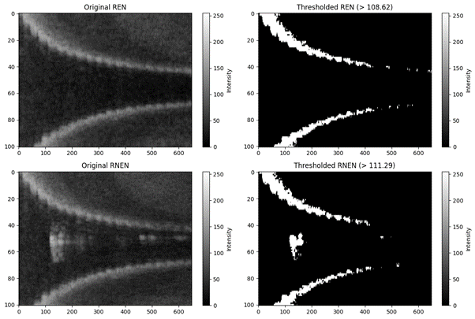

# Ping360 Sonar Data Analysis and Denoising
This repository is focused on data collection, analysis, and denoising of sonar data captured using the Ping360 sonar from Blue Robotics. The primary goal is to create a robust denoising method that eliminates ghost objects and other artefacts, providing cleaner data for analysis and object detection.

## Importance of Denoising Sonar Data
At off-the-shelf-grade sonars like Ping360 from Blue Robotics, we do not have access to the transmitted or received frequency response in raw form. The captured data is pre-processed and accessed via the API, providing values ranging from 0 to 255 on a converted scale. This introduces challenges like backscattering and ghost objects, which affect the quality of the sonar data. 

The main issues faced include:
- **Backscattering Problem:** Reflected signals from objects or boundaries cause interference.
- **Ghost Objects:** Erroneous objects that are not physically present.

To tackle these challenges, we:
1. Investigated the potential of Ping360 sonar with input from subject matter experts.
2. Conducted comprehensive experiments and statistical analysis.
3. Developed a denoising method that provides convincing results.

### Data Collection
If you're interested in collecting data using the Ping360 sonar:
1. Follow the instructions in the `Data Collection` folder.
2. Process the recorded data as outlined in the `Recorded Data Process` folder.

### Sample Analysis and Results
For a detailed analogy and to explore the potential of our denoising approach, please check out the three notebooks in the `Processed Data Analysis` folder.

**Some result samples**

## Sonar Sensor Data
### Data that is directly collected by sonar

## Polar co-ordinate Results
### Cartesian denoising to Polar Denoising

### Future Work
- Further analysis will be available once the project report/and our manuscript is published.
- My team is currently working to incorporate several state-of-the-art deep learning algorithms to explore object detection possibilities. Though this may not be immediately practical, we are optimistic about the future potential of this preprocessing analogy.

### Special Thanks
Special thanks to Dr. Somasundar Kannan for allowing me to use his experimental equipments, and give me full freedom to lead the team. Specially, Bryan from ENSEIRB-MATMECA. Also, later on, thanks to Hamid Reza for continuing to carry this work further with the collaboration with Prof. Jinchang Ren, and trying to push the limit with Oceaneering inc.

Stay tuned for more updates and insights!
